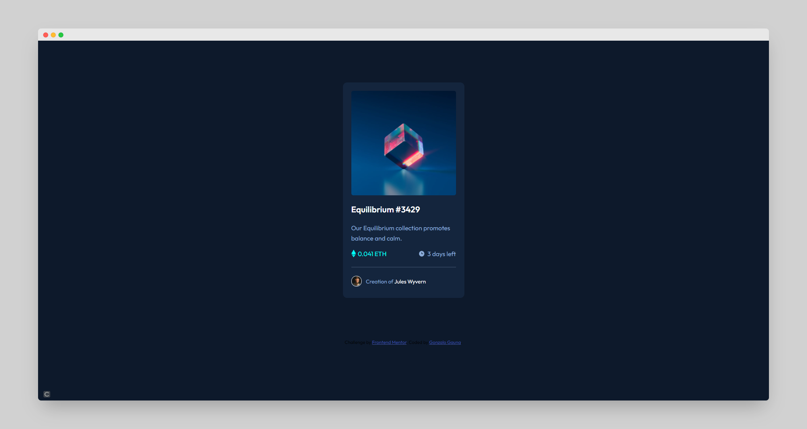

# Frontend Mentor - NFT preview card component solution

This is a solution to the [NFT preview card component challenge on Frontend Mentor](https://www.frontendmentor.io/solutions/card-practice-using-bem-and-flexbox-L76iF4PL9). Frontend Mentor challenges help you improve your coding skills by building realistic projects. 

## Table of contents

- [Overview](#overview)
  - [The challenge](#the-challenge)
  - [Screenshot](#screenshot)
  - [Links](#links)
- [My process](#my-process)
  - [Built with](#built-with)
- [Author](#author)

## Overview

### The challenge

Users should be able to:

- View the optimal layout depending on their device's screen size
- See hover states for interactive elements

### Screenshot

### Links

- Solution URL: [Solution](https://www.frontendmentor.io/solutions/card-practice-using-bem-and-flexbox-L76iF4PL9)
- Live Site URL: [Live Site](https://fm-nft-card-component.netlify.app/)

## My process

### Built with

- Semantic HTML5 markup
- CSS custom properties
- Flexbox

## Author

- Frontend Mentor - [@GonzaloGauna](https://www.frontendmentor.io/profile/GonzaloGauna)
- Twitter - [@gonzalogaunaDev](https://twitter.com/gonzalogaunaDev)
